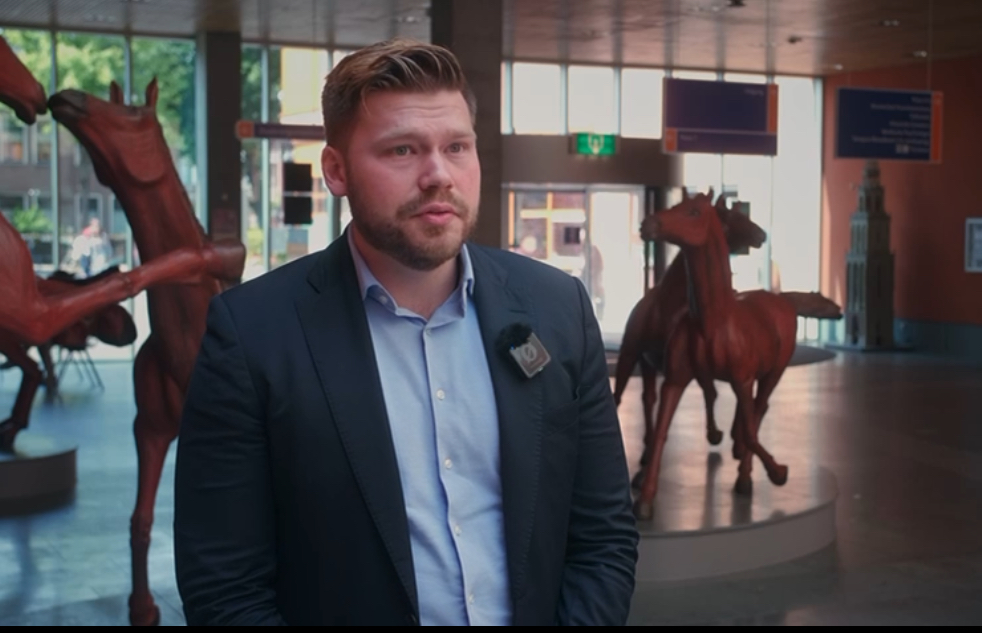
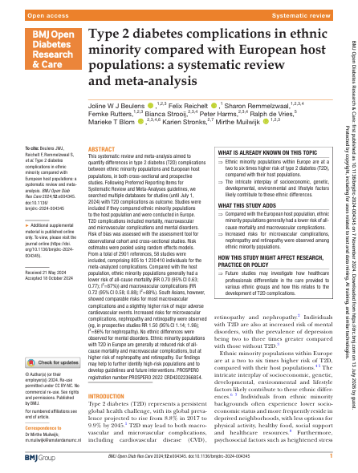
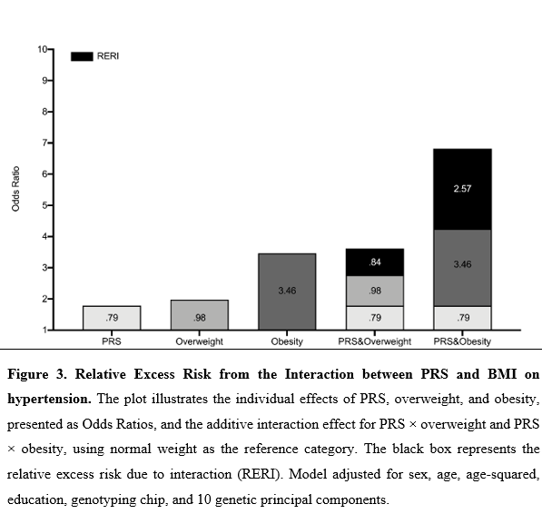

# 👋 Hi, I’m **Felix Reichelt**

I am a PhD candidate in **Genetic Epidemiology** at the **University Medical Center Groningen (UMCG) / University of Groningen** and a registered **Epidemiologist B**. My doctoral research is embedded in the **Stress-in-Action consortium**, a seven-university collaboration investigating how genetic vulnerability and stress exposures shape health across the life course.

My research focuses on why individuals differ in their exposure to stressful experiences and how genetic liability and stress jointly relate to cardiometabolic health. Specifically, I aim to:

1. Quantify the **heritability and genetic architecture of stress exposures and vulnerability traits**.
2. Characterize **genetic and environmental covariance between stress exposures and personality traits** using twin- and family-based designs.
3. Investigate **gene × stress-exposure and gene × stress-response interplay in cardiometabolic outcomes**.
4. Integrate **polygenic risk scores, clinical predictors, and large-scale cohort data** for etiological research and risk modelling.

I combine **large population cohorts, twin-family designs, statistical genetics, causal inference, and reproducible computational workflows**. My current work uses data from **Lifelines (N ≈ 160,000)**, the **Netherlands Twin Register**, and the **ImaLife cohort**. My broader background spans molecular cell biology, biomedical data science, proteomics, Mendelian randomization, and clinical genetic diagnostics, giving me experience across both wet-lab and computational research environments.

# 🔥 News

**2026.06:** 🎉 Oral presentation at the **Behavior Genetics Association (BGA) conference**: *“Genetic and Environmental Contributions to Personality–Stress Exposure Covariance in a Dutch Twin Sample.”*

**2025.08:** 🎉 Poster presentation at the **International Genetic Epidemiology Society (IGES) Conference**, Cologne.

**2025.03:** 🎉 Oral presentation at the **Max Planck Conference**.

**2025.03:** 🎉 Oral presentation at the **4th European Stress Conference**, Innsbruck, Austria.

**2025.08:** 🎉 Panel contribution at **ISCOMS, UMCG**: *“Innovating Stress Research: from Lab to Real Life.”*

**2024.05:** 🎉 Oral presentation at **WEON, the Annual Netherlands Epidemiology Congress**. The work was nominated for the **WEON Student Award**.

**2023.06:** 🎉🎉 Felix became a member of the [**Stress in Action Consortium (SIA)**](https://stress-in-action.nl/) — excited to work with excellent scientists and passionate early-career researchers dedicated to the study of stress! 👉 Visit [**Felix's profile on the Stress in Action website**](https://stress-in-action.nl/felix-reichelt/).

# 🚩 Research Projects

## Heritability and Genetic Architecture of Stress Exposures

Using the multigenerational **Lifelines cohort**, I investigate genetic and environmental contributions to long-term difficulties, stressful life events, childhood trauma, loneliness, and social support.

**Research focus:**

* Estimating the heritability of different stress exposures.
* Comparing genetic architecture across stressor domains.
* Investigating genetic correlations between stress exposures and vulnerability traits.
* Evaluating how familial and genetic liability may contribute to individual differences in exposure to stressful environments.

## Personality–Stress Exposure Covariance in Twin Data

Using data from the **Netherlands Twin Register**, I investigate why personality traits and stressful life events co-occur.

**Research focus:**

* Twin- and family-based variance decomposition.
* Genetic and unique environmental correlations.
* Dependent versus independent stressful life events.
* Sex differences in the magnitude of genetic and environmental contributions.

## Polygenic Risk, Stress, and Cardiometabolic Health

I investigate how **polygenic liability and stress exposures or stress responses jointly relate to cardiometabolic outcomes**.

Current work includes polygenic prediction and integrative risk modelling, with a particular focus on cardiovascular risk markers such as **coronary artery calcification in the ImaLife subcohort**.

## Causal Inference and Molecular Epidemiology

I also work with **Mendelian randomization and GWAS-derived data**. During my MSc research at the **Dutch Cancer Institute (NKI)**, I investigated causal effects of breast cancer risk factors across molecular breast cancer subtypes.

# 📑 PhD Thesis

**Title:** *When Genes Stress Out: Deconstructing the Heritability of Stress Exposures and their Relation with Cardiometabolic Outcomes*

**Institution:** University Medical Center Groningen / University of Groningen  
**Supervisors:** Prof. Harold Snieder, Prof. Eco de Geus, and Prof. Maryam Kavousi  
**Defense planned:** 1 July 2027

My thesis examines how stress exposures are shaped by genetic and environmental influences and how genes and stress jointly relate to cardiometabolic health. The work combines multigenerational cohort data, twin-family designs, GWAS-derived information, polygenic risk scores, and epidemiological methods.

# 📝 Publications and Ongoing Manuscripts

## Published

**Joline W. J. Beulens, Felix Reichelt, Sharon Remmelzwaal, Femke Rutters, Bianca Strooij, Peter Harms, Ralph de Vries, Marieke T. Blom, Karien Stronks, and Mirthe Muilwijk (2024).**  
*Type 2 diabetes complications in ethnic minority compared with European host populations: a systematic review and meta-analysis.*  
**BMJ Open Diabetes Research & Care, 12(6).**  
[DOI: 10.1136/bmjdrc-2024-004345](https://doi.org/10.1136/bmjdrc-2024-004345)

### Figure

## Preprint

**Anna D. Argoty-Pantoja, Zekai Chen, Felix Reichelt, Tian Xie, Chris H. L. Thio, and Harold Snieder (2025).**  
*Interaction between Lifestyle Factors and Polygenic Risk in Hypertension: Insights from the Lifelines Cohort Study.*  
**SSRN preprint.**  
[DOI: 10.2139/ssrn.5379908](https://doi.org/10.2139/ssrn.5379908) · [SSRN abstract](https://ssrn.com/abstract=5379908)

### Figure

This figure illustrates the individual effects of polygenic risk, overweight, and obesity on hypertension, together with their additive interaction effects. Overweight and especially obesity are associated with higher hypertension risk, and the excess risk is greater in individuals with higher polygenic risk. The positive relative excess risk due to interaction indicates that BMI amplifies genetic susceptibility beyond the sum of their separate effects. In line with the broader study findings, BMI showed the strongest interaction with polygenic risk among the lifestyle factors examined.

## First-Author Manuscripts in Preparation

**Heritability of Stress Exposures: Insights from the Lifelines Cohort**

**Replication of Stress Exposure Heritability Study in the Dutch Twin Registry**

**Polygenic Risk Score Analysis of Stress Exposures and Cardiometabolic Disorders**

# 🧑‍🏫 Academic Talks and Conferences

**2026:** Oral presentation, Behavior Genetics Association conference: *“Genetic and Environmental Contributions to Personality–Stress Exposure Covariance in a Dutch Twin Sample.”*

**2025:** *“Heritability of Stress Exposures: Insights from the Lifelines Cohort,”* presentation to the **Wissenschaftsrat (German Science and Humanities Council) delegation**, UMCG, Groningen.

**2025:** Oral presentation at the **Max Planck Conference**.

**2025:** Oral presentation, **4th European Stress Conference**, Innsbruck, Austria.

**2025:** Panel contribution, *“Innovating Stress Research: from Lab to Real Life,”* ISCOMS, UMCG, Groningen.

**2025:** Poster presentation, **International Genetic Epidemiology Society (IGES) Conference**, Cologne.

**2024:** Oral presentation, **WEON Annual Netherlands Epidemiology Congress**, Utrecht.

**2024:** Poster presentation, **Stress-in-Action Consortium event at the Royal Netherlands Academy of Arts and Sciences (KNAW)**, Amsterdam.

# 📖 Education

**2023–2027 — PhD Candidate, Genetic Epidemiology**  
University Medical Center Groningen / University of Groningen  
*Stress-in-Action: Genes–Stress Interplay and Cardiometabolic Health*

**2020–2023 — MSc Biomedical Sciences, Medical Biology**  
University of Amsterdam  
Major: **Big Biomedical Data Analysis**, including genomics, transcriptomics, proteomics, and metabolomics.

MSc research included **Mendelian randomization at the Dutch Cancer Institute (NKI)** and **comparative LC-MS proteomics at the Swammerdam Institute for Life Sciences (SILS)**.

**2015–2019 — BSc Molecular Cell Biology**  
Wageningen University & Research  
BSc thesis research focused on **antibiotic resistance in a genetics laboratory**.

# 💻 Methods and Skills

**Quantitative and statistical genetics:** twin- and family-based heritability modelling, variance decomposition, genetic correlation estimation, polygenic risk scores, GWAS-derived summary statistics, and multi-trait approaches.

**Causal inference and epidemiology:** Mendelian randomization, systematic reviews and meta-analysis, study design, bias and validity assessment, longitudinal data analysis, and prediction modelling.

**Programming and infrastructure:** R and Python, reproducible version-controlled workflows, large-scale cohort data, and high-performance computing workflows.

**Molecular and laboratory methods:** DNA/RNA isolation, qPCR, ELISA, flow cytometry, fluorescence microscopy, and LC-MS proteomics.

**Certification:** Laboratory Animal Science, species-specific rat and mouse module (**Article 9 certification**).

# 🎓 Professional Training and Memberships

I have completed **75+ ECTS of doctoral training** in genetic epidemiology, statistical genetics, epidemiology, applied statistics, scientific communication, research ethics, and research infrastructure.

Selected specialist training includes:

* Behavioral Genetics at Vrije Universiteit Amsterdam.
* GWAS prediction of complex phenotypes at Aarhus University Summer School.
* Mendelian Randomization at the University of Cambridge.
* Applied Longitudinal Data Analysis at the University of Groningen.
* Data Science and AI in Health at the University of Groningen Summer School.

I am a member of the **Vereniging voor Epidemiologie (VvE)** and participate in Stress-in-Action genetics working groups and the Epidemiologist B journal club. From 2023 to 2025, I represented UMCG in the **Stress-in-Action Junior Think Tank** and have experience supervising Bachelor-level research.

# 🧪 Prior Laboratory and Clinical Experience

Before my PhD, I worked across clinical and molecular laboratory environments:

**Sanquin, Amsterdam:** autoimmune diagnostics using ELISA, flow cytometry, and fluorescence microscopy.

**inBiome, Amsterdam:** high-throughput molecular COVID-19 diagnostics, DNA/RNA isolation, qPCR, workflow optimisation, and variant screening.

**Centogene, Rostock:** rare disease and oncogenetic diagnostics, including DNA extraction, biobanking, and work with BRCA1, BRCA2, and CHEK2 testing workflows.

**Eurofins, Wageningen:** pre-analytical laboratory specimen processing, tracking, and archiving.

# 🌍 Languages

🇩🇪 German (native) · 🇬🇧 English (C2) · 🇳🇱 Dutch (C1) · 🇸🇪 Swedish (A2) · 🇵🇱 Polish (A1)

# 🎯 Interests

Yoga · Ballroom dancing · Parachute jumping · Krav Maga · Traveling · Powerlifting · Science fiction

## ✉️ Contact

📧 [felix1395@live.de](mailto:felix1395@live.de)  
💼 [LinkedIn](https://www.linkedin.com/in/felixreichelt)  
🖥️ [GitHub](https://github.com/FelixReichelt13)  
🎓 [Google Scholar](https://scholar.google.com/citations?user=sIZi9sAAAAAJ)
